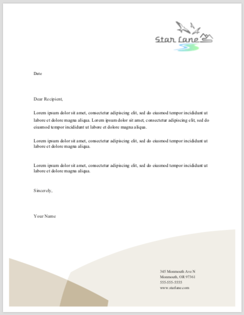
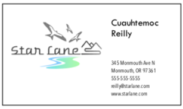
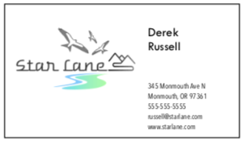
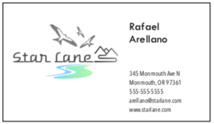
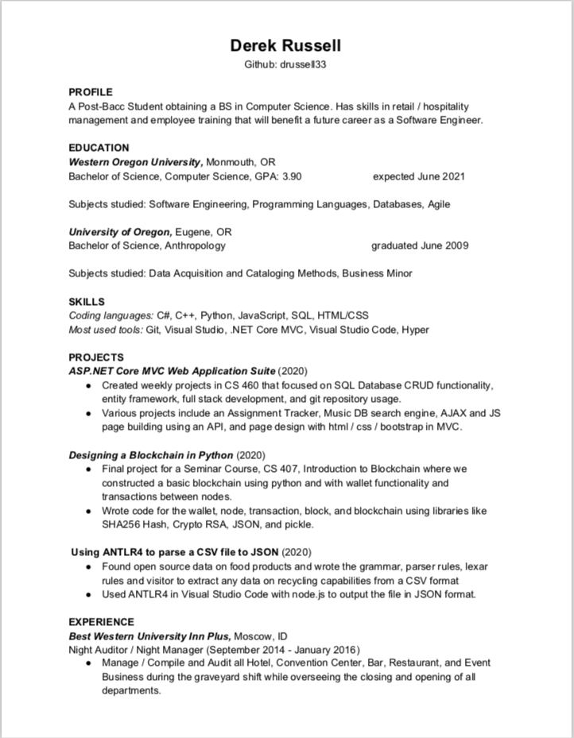
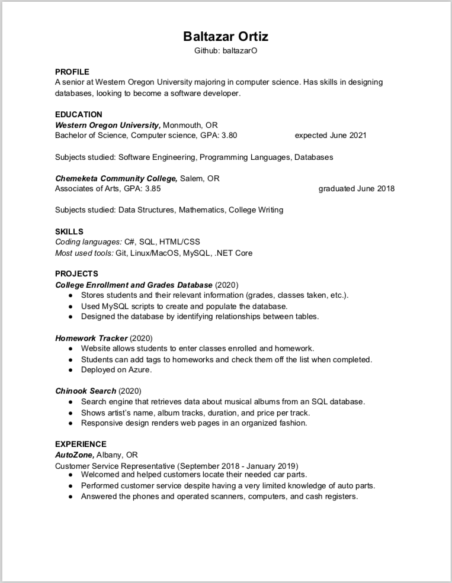
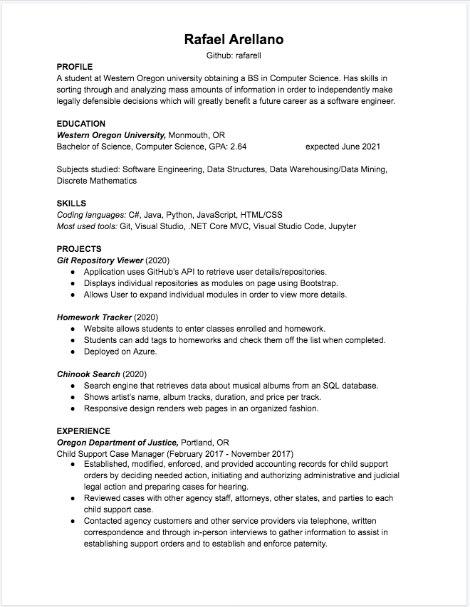

Team Star Lane Milestone 1
===========================

## Milestone 1 Assignment Link
[Milestone 1](https://wou-cs46x-resources.netlify.app/cs461/milestones/m1) 

## Team Name 
    Star Lane

## Team Motto
    Always Free

## Team Logo

## Team Letterhead

## Team Business Cards

## Resume for each team member

## Team Schedule
| Monday | Tuesday | Wednesday | Thursday | Friday | 
|:--- |:--- |:--- | :--- | :--- |
| *Meeting 1-2pm* | Meeting w/ Scot 1-2pm  | *Meeting 1-2pm*  | | *Meeting 1-2pm* 
| Class Lecture 2-4pm |*Meeting 2-3pm*  |Class Lecture 2-4pm  | | | 
  

# Team Project Ideas 
## COVID Probability Tracker -- 

    Need: Where did I get COVID-19 from? 

    How: The user will input, via forms, the places he or she thinks they got
    infected with COVID-19. The application will collect data about the positivity
    rates, population density, etc of the places entered by the user and display the 

## Rain Reminder -- 

    Need: My job is heavily impacted by the weather. I need to plan accordingly for 
    tomorrow and I may forget to watch the news for weather updates.

    How: The user will input the area where he or she works. The application will 
    request data from a weather REST API and send if it will rain/snow/ice or not 
    the next day to the user via text message or email. Also send when it will 
    rain/snow/ice and how long.

## Resume Experience Skill Extraction and Correlation -- 

    Need: A person may be losing their current employment position, or wish to 
    discover a new position that requires a similar skill set. It is sometimes 
    difficult to find these positions, as the average person doesn’t have very 
    much experience with the duties, tasks, and responsibilities of other jobs 
    in different industries and may not know what they would qualify for. 

    How: By extracting their employment experience commonly found in a person's 
    resume, we could break down their previous experience into individual skills 
    corresponding to the NAICS classification of Industry, the US Standard 
    Occupational Classification, and currently available Accredited College 
    Majors. This would give the user the ability to match aspects they liked or 
    were good at from their previous employment with positions in other 
    industries that are similar in their duties, tasks, responsibilities, 
    and skill sets required. 

## Driving Teacher --

    Need: I’m learning how to drive but I need to get ready for the driving 
    exam. I need a virtual teacher to answer my questions and quiz me on 
    driving questions.

    How: Two features: Make a search engine (like Chinook last term) to provide 
    answers to questions entered by the student. For feature 1, we can use 
    key words from the search query to look up the answer from the driving 
    manual. Quizzes that test the student’s knowledge of driving situations 
    and explain answers in depth.

## Recyclable Materials Helper

    Need: Recycling notifications has focused on the products themselves 
    from the manufacturers, or general lists provided by the recycling 
    servicer. Recycling centers lose a lot of money when their customers 
    recycle wrong items, and the dump fills faster when they don’t realize 
    that the material can be recycled. While most people know the general 
    guidelines for recycling, a lot of products are packaged in a questionable 
    way. So if the average person wanted to check to see if something they 
    are throwing away is recyclable, they would either have to inspect the 
    bag, service provider, or search online. But receiving this information 
    detailed to specific locations would clear all doubt immediately.

    Solution: Take a list of products and search product information via an 
    API. Determine their material and recyclability based on local 
    standards (via another API?)

## Riot Player Information Analyzer
    Need: I want to see more statistics about my online gaming habits.

    Solution: Offer suggestions of new characters to play based on the 
    characteristics of frequently played characters, analyse characters 
    or players you work well with and against and poorly against, etc. 
    using Riot Games API (and others?)

## Beer Garden Loyalty Application
    Need: I want to try all the beers, keep track of the ones I like, 
    and share these opinions with my friends. 

    Solution: Basically a social media platform that allows a user to 
    search or add beverages to their profile, and displays they for other 
    users to view or comment on. 
