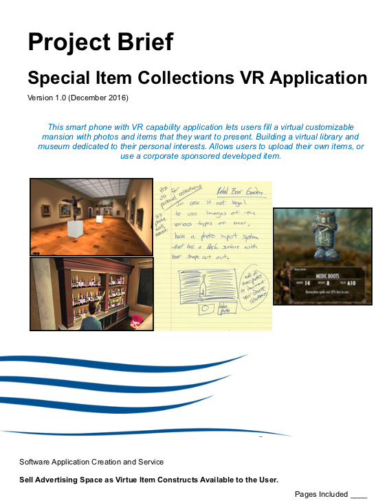

# 360 ICollectable Display Environment

This image was the original idea that is being modified for this project.

## Need: 
    Trophies, Books, Sports Memoriablia, Playing Cards, Trophy Fish, Awards, and even Funco POPs are just a few of the varied items people love to collect. Now more then ever with people need a way to show off their collections with co-works, friends, and family. 

## How: 
    Instead of creating albums of photos of these objects, we will provide users the ability to either render the item in 3D, or simply remove the background, and then place that item into a location slot of a 360 panaramic view. Create, Modify, and Share your own personal trophy room, and allow others to view the trophy room in the browser just like they do with virtual house tours.

## What is new/original about this idea:
    It is a new way to display, showcase, organize, and share collections of items that an individual cares deeply about. Its a new way to visit your friends virtually.
    
## What are possible API's?: 
  
[EyeSpy360 API & SDK](https://www.eyespy360.com/en-us/feature/API.html) creates 360 degree virtual views for house tours, might be able to modify.

[Best Virtual Reality SDK Software](https://www.g2.com/categories/vr-sdk) is a list of some of the top softwares that create 3D renderings, AR environment, 360 degree images, and virtual UI's to view said images and environment. 

[Background Removal API](https://www.remove.bg/api) is a simple API that can be used to remove the background of images.

[Prezi Player API](https://prezi.github.io/prezi-player/lib/PreziPlayer/) is an API for a prezi type environment (large digital surface that can be scrolled, zoomed in, moved around) that could work for a 2D rendering of the collections background

[Vizago API](https://www.programmableweb.com/api/vizago) creates 3D reconstruction or animation from a single photo.

    
## It's worth doing because:
    It hasnt been done before. Nearly every person has some sort of collection of items, and this is the perfect way to show off those items digitally.
    

## Major features: 
    - Users have private accounts that store any data they upload.
    - Users can upload photos of their items.
    - An API removes the background of the item photo, or can render the object in 3D, and with further development prepare the object for Augmented Reality Viewing.
    - Users can select various backgrounds to use to display their items.
    - The backgrounds can either be a 2D view, a 360 degree view, and with further development reach an Augmented Reality View.
    - The backgrounds have specific slots that allows the user to change their layout with ease.
    - Users can make their collections public, or private and share only with their friends.

## Difficulty Rating: 
    Basic User Account website: 4
    Photo Upload and storage: 6
    API to remove photo background: 4
    API to render item in 3D: 8
    2D collection environement background creation: 4
    360 degree collection environement background creation: 9
    Augmented Reality collection environement background creation: 10

## Functional requirements as user stories: epics and user stories
    1. [E] 
    1. [U] 
        - [T]
        - [T]
    2. [U]
        - [T]

## Appropriate initial modeling outputs UML
    coming soon maybe

## Initial system Architecture Drawing 
    coming soon maybe

## Vision Statement
    coming soon maybe

## Mindmap or other brainstorming artifacts 
    soming soon maybe
