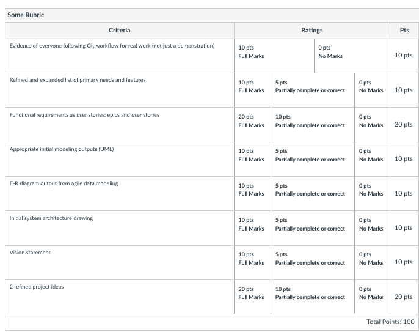
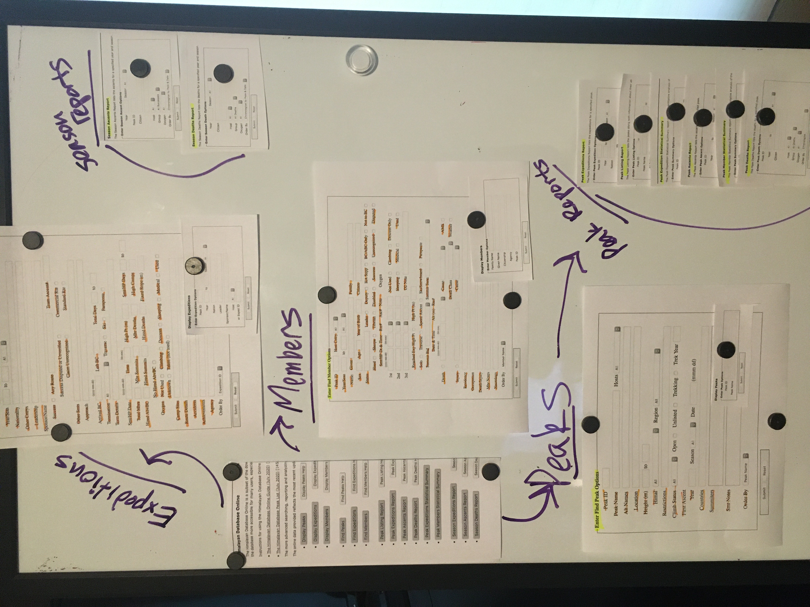
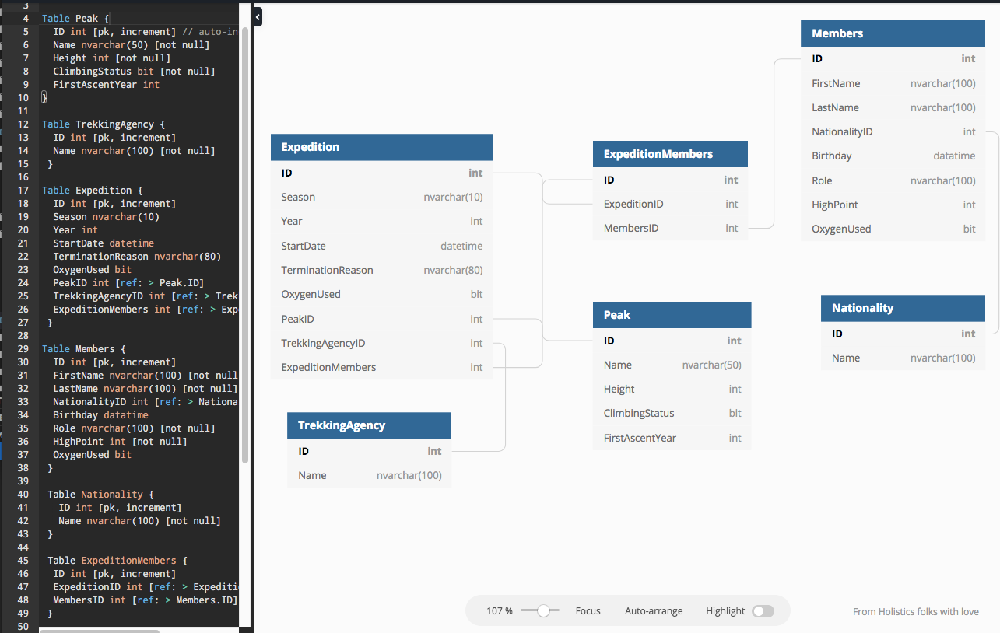
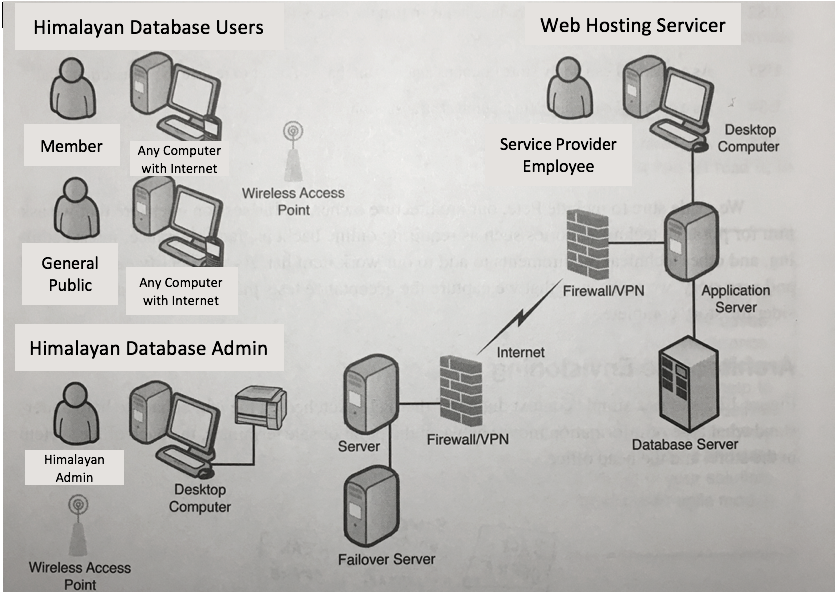

MIlestone 2
===========================

# Milestone 2 Assignment Link
[Milestone 2 Assignment Link](https://wou-cs46x-resources.netlify.app/cs461/milestones/m2) 

The Milestone 2 Rubric

# Evidence of everyone following Git workflow for real work. (10pts)

    When we look at the contributors sidebar, we can see that everyone has contributed, and when we look at the repos network stats to see the commits in graph format 

# Refined and expanded list of primary needs and features (10pts)
## List of Needs and Features
1. Secure and reliable
    - Write privileges to admin and member users
    - Only read for general public
    - Login system
    - Database backup
2. Search data on website
    - Search bar for specific content
3. Get all expedition mountain news from sources
    - Link to external news sources and APIs (example: www.planetmountain.com)
4. Verify incoming expeditions
    - Trekking agencies can add expeditions
5. Personalize dynamic content
    - Filters for content (expeditions, peaks, etc.)

## Identify Non-Functional Requirements
1. Meeting with stakeholders every 4 weeks
2. Data Storage 
3. Data Transmission 
4. Hardware
5. User Interface 
6. Availability 
7. Reliability 
8. Maintainability
9. Accuracy 
10. Regulations
11. Security 
12. Validation

# Functional requirements as user stories: epics and user stories  (20pts)

1. [U] As a visitor to the site I would like to see a fantastic and modern homepage that introduces me to the site and the features currently available.
   1. [T] Create starter ASP dot NET Core MVC Web Application with Individual User Accounts and no unit test project
   2. [T] Choose CSS library (Bootstrap 4, or ?) and use it for all pages
   3. [T] Create nice bare homepage: write initial welcome content, customize navbar, hide links to login/register
   4. [T] Create SQL Server database on Azure and configure web app to use it. Hide credentials.
   5. [T] Deploy it on Azure
2. [U] As someone who wishes to submit new information on an expedition I would like to be able to register an account so I will be able to use your services (once they're built)
   1. [T] Copy SQL schema from an existing ASP.NET Identity database and integrate it into our UP, DOWN scripts
   2. [T] Configure web app to use our db with Identity tables in it
   3. [T] Create a user table and customize user pages to display additional data
   4. [T] Re-enable login/register links
   5. [T] Manually test register and login; user should easily be able to see that they are logged in
3. [E] We want a secure and reliable website where the general public, administrators, and authenticated users can each have appropriate level access to the web application.
    1. [U] As a user I want to be able to log in to my account.
        a. [T] Make a login page
        b. [T] Get POST request and parse it
        c. [T] Compare hashed password
    2. [U] As a user I want to be able to sign out. 
        a. [T] Add a menu on the top left of page when signed in
        b. [T] When user clicks, “sign out” send POST request
        c. [T] Transition user state to “signed out”
    3. [U] As an administrator I want to be able to monitor the usage of our members to ensure the accuracy of their expedition data.
    4. [U] As a member I want to be able to submit my latest or upcoming expeditions so that my data is saved and submitted once.
        a. [T] When user submits form data, send POST request
        b. [T] Parse POST request data model and error check
        c. [T] If legit data, update database
        d. [T] Else print error message
    5. [U] As a general public user I want to be able to search for data by member, peak, expedition, and other criteria so that I can find the information I want.
    6. [U] As a user I don't want my personal data to be leaked to the public to ensure my privacy.
        a. [T] 
4. [E] We want to be able to search for data on the website, and have an accurate result sent back to us. 
    1. [U] As a general public user I want to be able 
        

# Appropriate initial modeling outputs UML (10pts)
    This is where the UML output should go, but i thought the ER diagram showed it in UML output, so.....

# E-R diagram output from agile data modeling (10pts)

[Link to dbdiagram](https://dbdiagram.io/d/5fcfdf459a6c525a03ba513f) 

# Initial system Architecture Drawing (10pts)

# Vision Statement (10pts)

**For** anyone **who** wants to request or submit information requarding, **the** moutaining climbing peaks, members, and expeditions data, **can** use a dynamic updating website **that** will provide a single point of access to the Himalayan Database. The system will store the data available for mountain peaks, registered members, and expeditions, and it will allow the general public the abilitiy to search for this data, while having the most up to date info, news stories, publications, ect., so that it will be the central hub for all up to date climbing information. **Unlike** the current website, **our users** will be able to have the most up to date information in a much more user friendly and dynamic way, and our data can become a trusted resource.

# 2 Refined Project Ideas (20pts)
## Riot Player Information Analyzer
    Need: I want to see more statistics about my online gaming habits.

    Solution: Offer suggestions of new characters to play based on the 
    characteristics of frequently played characters, analyse characters 
    or players you work well with and against and poorly against, etc. 
    using Riot Games API (and others?). Data is extrapolated primarily
    from list of N previous matches retrieved for a particular user.
    This can be repeated to a set depth, to increase the quality of data 
    available. Players can be profiled based on this collected data, and
    perhaps stored in a database for faster reference in later searches.
    These may be best separated into different features.
    
    A number of similar applications exist, however they tend to focus
    on very large-scale data. More personalized data is an unexplored 
    niche. 
    
    Major features: 
    - Analyze patterns of player behavior to create a profile.
    - Provide suggestions based on these profiles.
    - Interpret patterns of compatibility between players with different
      profiles.
    
    Primary additional tool: Riot Games' API. Primary limitation: 
    endpoint rate limits.
    
    Algorithmic features:
    Profiling players. Likely to include some kind of system of weighted
    events.
    
    Difficulty rating: 6. Finding suitable algorithms to model behavior
    is an anticipated challenge.
## Resume Experience Skill Extraction and Correlation
    Need: A person may be losing their current employment position, or wish to 
    discover a new position that requires a similar skill set. It is sometimes 
    difficult to find these positions, as the average person doesn’t have very 
    much experience with the duties, tasks, and responsibilities of other jobs 
    in different industries and may not know what they would qualify for. 

    How: By extracting their employment experience commonly found in a person's 
    resume, we could break down their previous experience into individual skills 
    corresponding to the NAICS classification of Industry, the US Standard 
    Occupational Classification, and currently available Accredited College 
    Majors. This would give the user the ability to match aspects they liked or 
    were good at from their previous employment with positions in other 
    industries that are similar in their duties, tasks, responsibilities, 
    and skill sets required.

    What is new/original about this idea: 
    - Breaking down previous experience into individual skills and tasks. 
    - Matching personal skills with national classification standards and accredited institutions for degrees and certifications.
    - Assists the user with creating a roadmap to acheive desired occupation titles from their current skill set.

    What are related websites/apps?: 
    Indeed and Glass Door have a good search engine.
[Emsi Skill Extraction Website](https://skills.emsidata.com/) 

    It's worth doing because everyone could benifit from a roadmap to skill acquistion to acheive their desired goals.

    Major features: 
    - Extracting information from a users resumes in a few formats 
    - Creating a list of occupational titles that most closely relate the users current skill base.
    - The User can select a desired occupation title and generate a roadmap to aquire any additional skills into their skill base required for said occupation.
    - The User can input their location, and options for degrees and certifications missing from their roadmap would be generated

    Possible resources Required: 
    - Bureau of labor statistics API
    - Indeeds API
    - CollegeAI API
    - The process of extracting data from word or pdf files to match.

    The main algorithm will need to break occupations down into skills, consider those skills either acheived or needed, and link to local options for acheivement. 

    Difficulty Rating: 
    - API usage: 6
    - Resume Scraping: 9
    - Algorithmic Components: 7
