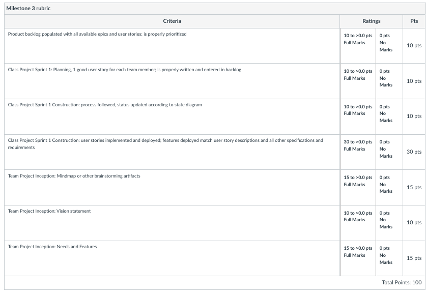

Milestone 3
===========================

## Milestone 3 Assignment Link
[Milestone 3 Assignment Link](https://wou-cs46x-resources.netlify.app/cs461/milestones/m3) 

The Milestone 3 Rubric

# Product backlog populated with all available epics and user stories; is properly prioriitized (10pts)
    This is where a link to the product back log for the class project will go. (where should we keep the backlog? I was thinking in the top level of the class_project_code folder within the repo)

# Class Project Sprint 1 Planning: good user story for each team member; is properly written and entered in the backlog (10pts)
    Seems like this is judging the product backlog user story that each of us completed this week.

# Class Project Sprint 1 Construction: process followed, status updated according to state diagram (10pts)
    What?

# Class Project Sprint 1 Construction: user stories implemented and deployed; features deployed match user story descriptions and all other specifications and requirements (30pts)

# Team Project Inception: Mindmap or other brainstorming artifacts (15pts)

# Team Project Inception: Vision statement (10pts)

# Team Project Inception: Needs and Features (15pts)