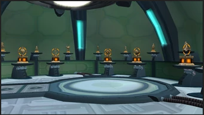
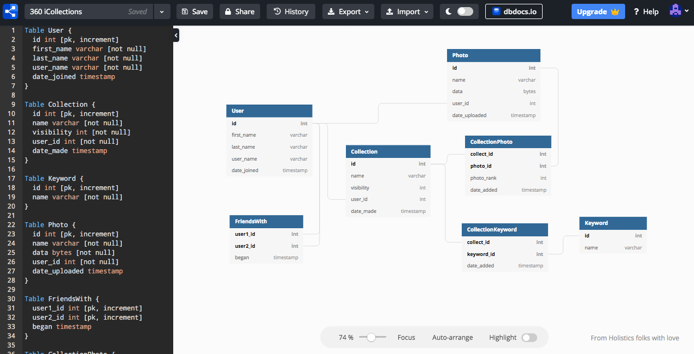
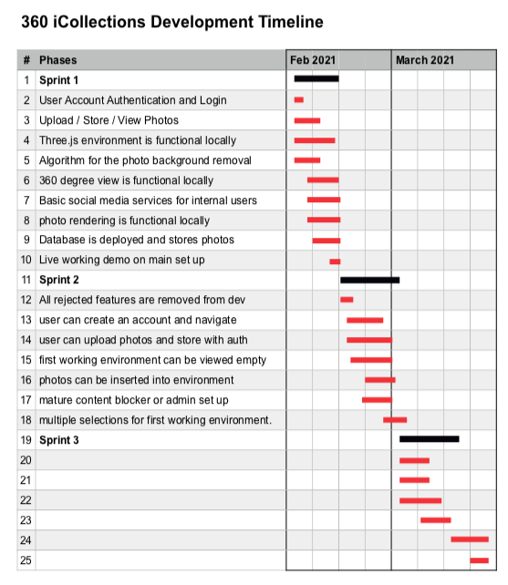

Starlane Project Inception
=====================================

# Team Project Inception: Vision statement

**For** anyone **who** wants a easy and fun way to share with others their collections or collectables, **the** 360 iCollectables Creator **can** upload and render photos of their collectable items **that** will be displayed in 2D, 360 degree, or possibly 360 full virtual environment. The system will store the users uploaded photos of items, allow user selection of the available environments, and give the ability to place their items into the environment at specific locations, and then allow others to view their environments filled with their collectable items. **Unlike** albums of photos **our users** will be able to show off large collections of items in a single format that can easily show the scale of the collection, while maintaining the ability to inspect individual items closely. 

# List of Needs and Features
1. **Need:** We need to to have a basic user account based site with user profiles design and light social media capabilities. The database that needs to store the user data, as well as the photos (and environments later)
    - **Feature:** Users have individual account that have light social media capabilities for levels of sharing privacy, similar to depth that Github Provides
    - **Feature:** Users can upload there photos either one at a time or as a folder
    - **Feature:** Users can view there photos that they have previous uploaded and organize them within folders. 
        1. **E:** As a user of this site, I want to have a home page that describes all the features of this service. I would like to have a basic account profile, with my user name and other basic information. I would like to add others as friends and follow others. 
            - **U:** As a visitor of this site for the first time, I would like to learn about it and see its features and basic information before I decide to make a profile 
                1. The home page needs to have a good modern feel and clear color and font theme.
                2. 360 iCollectables needs to be the main title
                3. An image of a sample of the environment needs to be displayed with the title
                4. our vision statements needs to have a section 
                5. a carosole of our features needs to be another section
                6. A quick Q and A needs to be another section. 
                7. A Sample viewer needs to be another section.
                8. The home page needs a good navbar and link to login or new user.
                8. Acceptance criteria will contain all of these sections, with empty templates for the environment and sample to be filled in with another user story.
            - **U:** As a vistor of this site that decides to create an account, I would like the process to be as quick and easy as possible.
                1. The account create page needs to be customized with the ASP.net Core MVC account auth framework we will be reciving a video on soon.
                2. Once we know the frame work we will need to learn how to edit it to obtain all the data we need from the user for there account and profile data.
                3. we need to have the creation of the account also create a profile page and dash board for the user (can be blank spaces for other user stories)
                4. Form data being sent to the database 
                5. encrypting, hashing and salting, user passwords.
                6. The creation of the account bring the user to there new dashboard.
            - **U:** As a user of this site, I would like to have a nice looking profile page that shows my basic information, and has a section that shows my iCollections that I've published.
                1. Required data for the user account needs to auto populate those areas in their profile, username, location, ect. 
                2. An img of the user needs to be in the profile page. 
                3. a clear section for basic information needs to be on the page. 
                4. a section for published iCollections needs to be on the page in a scrolling fashion in order of most recent at the top. 
                5. The user profile page needs to be private if the user selects it to be.
            - **U:** As a user of this site, I would like to easily find my friends and other users based off their username, or key words found in their iCollection titles or tags.
                1. We need to create add the ability to search for friends by username.
                2. we need to create a query that can generage a page view that has a list of the iCollections found that match.
                3. we need a way for users to either have their entire profile public or private.
                4. we need to omit the users who selected private from any search results, both their profile, and any iCollections that they have published on their account. 
            - **U:** As a user of this site, I would like to have a basic activty feed that shows me my friends recents iCollections, and other public iCollections of which I have decided to follow.
                1. Each user needs a dashboard page.
                2. The dashboard needs to have a section for a recent activity area.
                3. The dashboard needs to have a section where the user can view there photo folders or navigate to the photos page.
                4. The dashboard needs to have a section that shows all of the users icollections. this is the largest section of the dashboard.
                5. The dashboard should looks similar to the youtube dashboard.
        2. **E:** As a user of this site, I would like to have a quick and easy way to upload my photos or groups of photos so that I can select which ones I want to use in a new iCollection.
            - **U:** As a user of this site, I would like to be able to easily see my photos that are stored in albums, and have a basic ui cable of letting me move the photos around, and make new folders. 
            - **U:** As a user of this site I want to have the option of deleteing the individual photos after I used them in an Icollection.
            - **U:** As a user of this site, I want to make sure that my private data stays private and that only the users I select can view my iCollections.
            - **U:** As a user of this site, I want to ensure that all the metadata from my photos is removed when I upload them. 
            - **U:** As a user of this site, I want select my photos for an iCollection while I am making it.
            - **U:** As a user of this site, I want to prepare a folder of photos that I want to use to make a new iCollections. 
        3. **E:** As a user of this site, I want to browse public iCollections so I can compare them against mine, get ideas for my own iCollections, and find iCollections by keyword descriptions.
        4. **E:** As a user of this site I want a dashboard that can show exisiting collections the user has made, and links to create a new collection, edit their exisiting ones, or browser their friends and public collections
            - **U:** As a user I want a dashboard that shows my firends activy as well as the activity of anyone im following. 
            - **U:** As a user I want a dashboard that shows My photos as an overview in a section so I can keep track of my grouping
            - **U:** As a user I want a dashboard that shows a better way for users to view their creations, raw photo uploads, and decide upon which activity they want to do.
        5. **E:** As a user of this site I want to have a way to set levels of visibility for our users so that they can choose who they want to share their collections environments with.
            - **U:** as a user i want a way to either have a private collections, unlisted collection, or public collection.
2. **Need:** We need to have a way for our users to take their photos on their account, and render them into different formats before they are inserted into an iCollection environment and published.
    - **Feature:** Raw photos or background removed photos can go into predesigned slots or used for 2D flood fill of various shapes.
    - **Feature:** photos need to be rendered in 3D to be placed with the virutal environement.
        1. **E:** As a user of this site, I want to be able to be able to remove the background from a photo before I place it into an environment.
        2. **E:** As a user of this site, either use photos that are stored on my account, or ones that are uploaded at the time the iCollection is being made.
        3. **E:** As a user of this site, I want to be able to be able to render a photo so that it can be placed into a 2D iCollections environemnt. 
        4. **E:** As a user of this site, I want to be able to be able to render a photo so that it can be placed into a 360 degree iCollections environemnt. 
        5. **E:** As a user of this site, I want to be able to be able to render a photo so that it can be placed into a virtual iCollections environemnt. 
3. **Need:** We need to Create the 2D collectables environment viewer, creator, and template, and allow the templates to be filled with either unaltered photos, or background removed photos.

    - **Feature:** Users can selecte either an unaltered photo or a background removed photo and a flood-file algorithm will insert all of the images as tightly as possible into the shape outline. 
    - **Feature:** besides a simple square, there are other shapes like circles, arrows, or mazes that can be filled in with photos.
    - **Feature:** I can view the final iCollections 2D environment in the browser, with the ability to zoom and navigate across the 2D surface. 
        1. **E:** As a user of this site, when I want to create a 2D iCollections where I select a large group of photos and they are inserted into the environment.
        2. **E:** As a user of this site, when I create a 2D iCollections I want to select to either have the background removed from my photos or have unaltered photos loaded into the environment. 
        3. **E:** As a user of this site, when I create a 2D iCollections I want to select different environments to input my photos into. 
        4. **E:** As a user of this site, when I create a 2D iCollections I want to upload a high quality photo to be used as the 2D background. 
        5. **E:** As a user of this site, when I create a 2D iCollections like an arrow or a maze, I want the photos to be filled in order of the date that they were taken. 
4. **Need:** We need to create an virtual iCollections environment viewer, creator, and templates, and allow the templates to be filled with either unaltered photos, background removed photos, or 3D rendered photos.

    - **Feature:** Using three.js there needs a be a small selection of environments that the user can select for a virtual iCollection.
    - **Feature:** Provide users the ability to view the empty iCollection virtual environment selections so that they can preview selections.
        1. **E:** As a user of this site, I want to be able to create an iCollection that is in a small virutal environment that contains the photos I uploaded.
        2. **E:** As a user of this site, I want to be able to preview the environment so that I can make a better selection for what would work best for me.
        3. **E:** As a user of this site, I want to be able to use raw 2D photos, or render the photos into 3D when they are inserted. 
        4. **E:** As a user of this site, I want to be able to select where my photos will go in the environment.
        5. **E:** As a user of this site, I want to be able to preview my iCollection with the photos inserted so I can decide to publish it, or modifiy it. 
        6. **E:** As a user of this site, I want to be able to edit my collection by adding, removing, or deleting the photos before I publish it. 
        7. **E:** As a user of this site, I want to be able to keep my raw photos on my account after I use them and publish an ICollection.
        8. **E:** As a user of this site, I want to be able to take a published iCollection and modify it.  

5. **Need:** We need to Create the 360 collectables environment viewer, creator, and templates, and allow the templates to be filled with either unaltered photos, background removed photos, and 3D rendered photos.
    - **Feature:** Show The 360 environment templates that are available for the user to choose from.
    - **Feature:** A User can place rendered photos into the 360 environment in pre-designed slots.
    - **Feature:** 360 degree viewer is in the browser so that the finished collectables can be viewed.
    - **Feature:** Use on mobile photo to physically view the 360 environments by moving the phone around.
        1. **E:** As a user of this site, 

# Initial Architecture Envisioning
    Desktop computer: PC or Mac
        Internet access
        Internet browser
        
    Cloud: Azure 
        web server
            .NET Core
            C#
        SQL server
        SQL database
            DBMS: Microsoft SQL Server
    
    API: photo background remover

# Agile Data Modeling
    Diagrams, SQL modeling (dbdiagram.io), UML diagrams, UI wireframes, page flows, ...

[Flow Chart / Mindmap ](https://miro.com/app/board/o9J_lXPB2mE=/) 

<!--  -->

[dbdiagram initial data model ](https://dbdiagram.io/d/6019335180d742080a38d1e9) 

## DB Designing Brainstorming txt file.
[DB Designing Work Link to seperate txt file.](DB_design.txt) 

# Timeline and Release Plan

# Identify Functional Requirements (In User Story Format)

E: Epic  
U: User Story  
T: Task  

1. [E] We need a database that can hold the user account data, profile data, photos, altered photos, and published collections. 
    1. [U] We need to take the rough DB design Baltazar made and research and expand it.
        - [T] [dbdiagram initial data model ](https://dbdiagram.io/d/6019335180d742080a38d1e9) 
2. [E] We need to make sure that our complex database can be hosted on azure, and not cost a bunch of money. 
    1. [U] We might need to do this that Cuauhtemoc found but should wait until Scot goes over the ASP .NET auth accounts stuff 
        - [T] [Adding Users to Your SQL Azure Database](https://azure.microsoft.com/en-us/blog/adding-users-to-your-sql-azure-database/)
3. [E] We need to make sure that we can use Entity Framework and properly encapsulate the photos so that they can be called easily, and in groups. 
    1. [U] We need to find a framework for this and test it out. 
        - [T] [store images in SQL Server using EF Core and ASP.NET core](http://www.binaryintellect.net/articles/2f55345c-1fcb-4262-89f4-c4319f95c5bd.aspx)
4. [E] Photos are associated with a user account so that the user can perform CRUD operations.
    1. [U]   
        - [T]
5. [E] We need to make sure that we can remove the background from photos.
    1. [U] We need to test this background removal algorithm that Cuauhtemoc found 
        - [T] [background removal implementation in python](https://github.com/danielgatis/rembg)
6. [E] We need a flood fill algorithm that can insert a lot of photos into a shape as tightly as possible.
    1. [U] 
        - [T]
7. [E] The 2D iCollection environment needs a viewer for published ones in the browser window. 
    1. [U] 
        - [T]
8. [E] Three.js needs to be confirmed that it can be used for the environment creations, browser viewer, and capability to insert photos.
    1. [U] three.js seems like the best option for a virtual environment, but it needs to be tested.
        - [T] [three.js Getting Started Tutorial for creating and viewing a scene](https://threejs.org/docs/index.html#manual/en/introduction/Creating-a-scene)
        - [T] [example of the environment we would have.](https://threejs.org/examples/#webgl_animation_cloth)
9. [E] We need to decide on the best method / API / code to render photos into 3D objects.
    1. [U] 
        - [T]
10. [E] We need to decide on the best method / API / code create an iCollection in a 360 degree view environment.
    1. [U] We need to decide if we want to implement this feature, which option is the best one to try, and if that best option worked or does another option need to be tried.
        - [T] [Options for 360 degree environment](https://ourcodeworld.com/articles/read/843/top-7-best-360-degrees-equirectangular-image-viewer-javascript-plugins)

# Identification of Risks
    1. The most basic 2D feature might be the best we can do.
    2. The 360 enviornment might not be possible 
    3. The virutal environment might be too difficult to add objects into.
    4. To many unknowns that could break the most advanced features of this project. 

[words](url)

<a href="README.md">Return to Milestone 4 README file</a>
